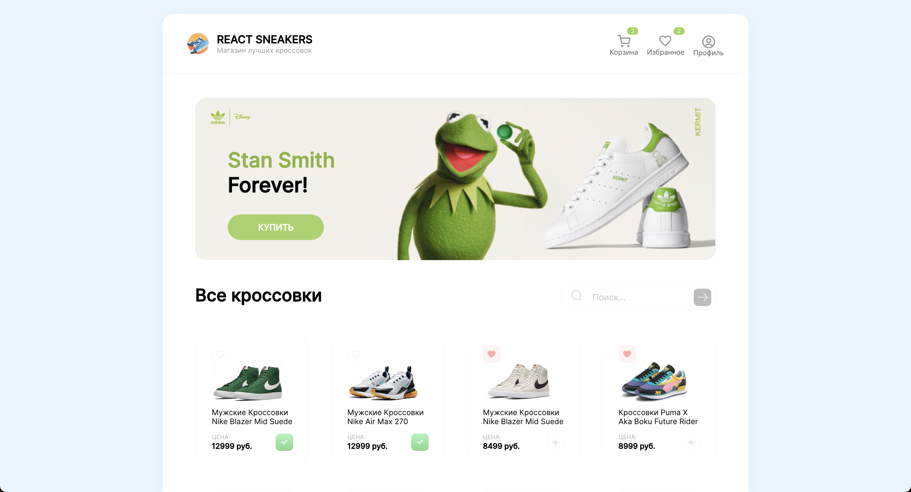

<div id="top"></div>

<!-- PROJECT LOGO -->
<br />
<div align="center">

<h3 align="center">REACT SNEAKERS</h3>

  <p align="center">
    <a href="https://github.com/Akhtool/react-sneakers/issues">Сообщить о баге</a>
  </p>
</div>

<!-- СОДЕРЖАНИЕ -->
<details>
  <summary>Содержание</summary>
  <ol>
    <li>
      <a href="#about-the-project">О проекте</a>
    </li>  
    <li><a href="#preview">Превью</a></li> 
    <li><a href="#instalation">Установка</a></li>
    <li><a href="#contact">Контакты</a></li>
  </ol>
</details>

<!-- О ПРОЕКТЕ -->

# О проекте

### ДОБРО ПОЖАЛОВАТЬ НА REACT SNEAKERS!

React Sneakers - это небольшой веб-сайт, созданный с помощью React, демонстрирующий широкий ассортимент модных кроссовок для любителей. Веб-сайт использует различные хуки React для обеспечения плавного и интерактивного взаимодействия с пользователем.

#### Основные возможности:

**Избранное:** Пользователи могут легко добавлять свои любимые кроссовки в личный список избранного. Это позволяет им быстро получать доступ к своим любимым кроссовкам и просматривать их без каких-либо хлопот.

**Корзина покупок:** React Sneakers предлагает удобную функциональность корзины покупок. Пользователи могут добавлять кроссовки в свою корзину, просматривать содержимое и управлять количеством. Это обеспечивает плавный процесс покупки и позволяет пользователям отслеживать выбранные ими товары.

**Создание заказа:** Как только пользователи будут удовлетворены своим выбором, они могут приступить к созданию заказа. React Sneakers обеспечивает простой процесс создания заказа

**История заказов:** Пользователи имеют доступ к специальному разделу, где они могут просматривать историю своих заказов. Эта функция позволяет им отслеживать свои прошлые покупки и ссылаться на такие детали, как заказанные товары

**Поиск кроссовок по запросу:** Реализован быстрый поиск кроссовок, при вводе необходимого названия пользователь может найти свои любимые кроссовки

# Превью

**Главная страница**



**Превью приложения**


**Превью функционала приложения**


<div id="instalation"></div>

<!-- GETTING STARTED -->

# Установка

1. Склонируйте репозиторий
   ```sh
   git clone https://github.com/Akhtool/react-sneakers.git
   ```
2. Зайдите в папку react-sneakers
   ```
   cd react-sneakers
   ```
3. Установите NPM пакеты
   ```sh
   npm install
   ```
4. Запустите сервер
   ```sh
   npm run server
   ```
5. Разверните приложение в браузере
   ```sh
   npm run start
   ```

<!-- КОНТАКТЫ -->

# Контакты

Zelimkhan Dzhumaev

- [Telegram](https://t.me/akhtool)
- [Instagram](https://www.instagram.com/zelimhan995)

Ссылка на проект: [React sneakers](https://github.com/Akhtool/react-sneakers)

<p align="right">(<a href="#top">Back to top</a>)</p>
